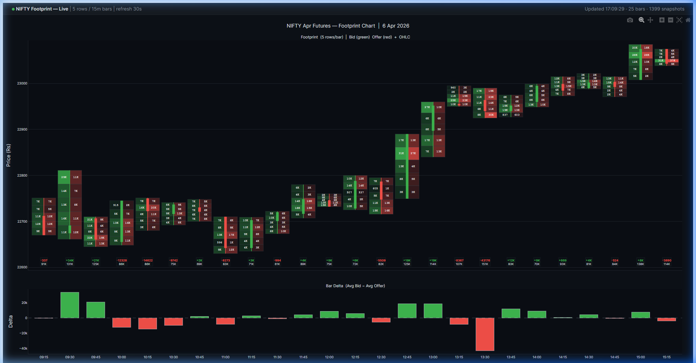

# 📊 Footprint Chart - Plotly

An interactive **order-book footprint chart** built with [Plotly](https://plotly.com/python/), designed for intraday auction-market analysis.

Each time bar is divided into adaptive price buckets showing **bid vs offer pressure**, with OHLC candles overlaid and a delta histogram below.




---

## Features

| Feature | Description |
|---|---|
| **Adaptive buckets** | Each bar's high–low range is split into *N* equal rows — no fixed tick size needed |
| **Bid / Offer cells** | Left half (green) = bid pressure, right half (red) = offer pressure |
| **Intensity scaling** | Cell opacity scales with volume — hot zones pop instantly |
| **Contrast text** | Label colour auto-switches (black / white) based on cell luminance |
| **OHLC overlay** | Thin candle body + wick drawn over the footprint grid |
| **Delta histogram** | Row 2 shows per-bar delta (Σ bid − Σ offer) with zero line |
| **Rich hover** | Hover any cell for bid, offer, delta, and total breakdown |
| **Dash-ready** | Optimised to ~82 DOM nodes (vs ~577 naïve) for live refresh |

## Performance Optimisation

The chart is designed for **live / Dash use** with minimal DOM overhead:

```
Naïve approach               Optimised
─────────────                ──────────
~250 SVG rect shapes    →    2 Bar traces
~250 annotations        →    1 Scatter(mode='text')
~50  candle shapes           ~50 candle shapes (same)
≈ 577 DOM nodes              ≈ 82 DOM nodes  (−85%)
```

---

## Quick Start

### Install dependencies

```bash
pip install plotly pandas numpy
```

### Prepare your CSV

The script expects a **headerless CSV** with 6 columns:

```
bid_qty, bid_orders, offer_qty, offer_orders, datetime, price
```

| Column | Type | Description |
|---|---|---|
| `bid_qty` | float | Total bid quantity at this price level |
| `bid_orders` | int | Number of bid orders |
| `offer_qty` | float | Total offer quantity at this price level |
| `offer_orders` | int | Number of offer orders |
| `datetime` | str | Timestamp (any pandas-parseable format) |
| `price` | float | Price level |

### Run

```bash
# Generate HTML (saved beside the CSV)
python footprint_plotly.py --csv data.csv

# Generate + open in browser
python footprint_plotly.py --csv data.csv --show

# Customise
python footprint_plotly.py --csv data.csv --rows 6 --bars 10 --title "ES Futures"
```

---

## CLI Options

| Flag | Default | Description |
|---|---|---|
| `--csv` | *(required)* | Path to the order-book CSV file |
| `--show` | `false` | Open the chart in your default browser |
| `--rows` | `5` | Number of price rows per bar |
| `--bars` | `15` | Bar interval in minutes |
| `--title` | auto | Custom chart title (auto-generates from date if omitted) |

---

## How It Works

```
CSV snapshots
     │
     ▼
┌─────────────┐
│  load_data   │  Parse CSV → compute avg_bid, avg_offer per row
└─────┬───────┘
      │
      ▼
┌──────────────────┐
│  build_footprint  │  Group by time bar → adaptive buckets → aggregate
└─────┬────────────┘
      │
      ▼
┌──────────────┐
│  build_figure │  Plotly Bar traces + Scatter text + OHLC shapes
└──────────────┘
```

1. **`load_data()`** — reads the CSV, computes `avg_bid` and `avg_offer` (qty ÷ orders).
2. **`build_footprint()`** — groups snapshots into time bars, divides each bar's price range into equal buckets, and aggregates bid/offer per bucket.
3. **`build_figure()`** — renders the two-row Plotly figure using trace-based rendering for performance.

---

## Dash Integration

The `build_figure()` function returns a standard `go.Figure` that plugs directly into a Dash `dcc.Graph`:

```python
from dash import Dash, dcc, html, Input, Output
from footprint_plotly import load_data, build_footprint, build_figure

app = Dash(__name__)
app.layout = html.Div([
    dcc.Graph(id="chart"),
    dcc.Interval(id="tick", interval=30_000),
])

@app.callback(Output("chart", "figure"), Input("tick", "n_intervals"))
def refresh(_):
    df = load_data("live_data.csv")
    bars = build_footprint(df, n_rows=5, bar_min=15)
    return build_figure(bars)

app.run(port=8055)
```

---

## Theme

The default dark theme uses GitHub-dark colours. Override by editing the constants at the top of the script:

```python
C_BG         = "#0d1117"   # page background
C_TEXT       = "#e6edf3"   # text colour
C_GRID       = "#21262d"   # gridlines
C_CELL_BDR   = "#30363d"   # cell borders
C_CANDLE_UP  = "#3fb950"   # bullish / bid
C_CANDLE_DOWN = "#f85149"  # bearish / offer
```

---

## License

MIT
